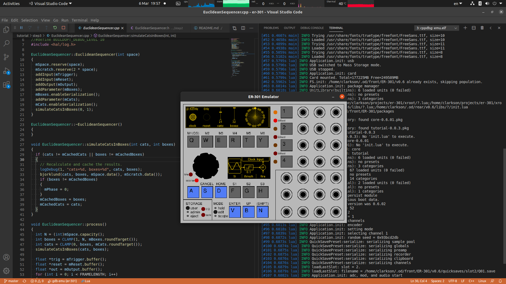

# Tutorial



## Table of Contents

  * [Introduction](#introduction)
  * [Step 1: Make your first unit](#step-1-make-your-first-unit)
  * [Step 2: Add custom DSP code](#step-2-add-custom-dsp-code)
  * [Step 3: Add custom graphics](#step-3-add-custom-graphics)
  * [Further Reading](#further-reading)

## Introduction

This folder contains 3 example projects that progressively increase in complexity and sophistication.  In each step, you create a package (called tutorial) containing one or more units.  First you will create a unit (called FM Operator) using only lua scripting.  Next, you will create yet another unit (call Euclid's Cats) that has your C++ DSP code.  Finally, you will enhance the Euclid's Cats unit with your own custom graphics.

:warning: You have a choice to either use these tutorial projects in-place OR you can copy them out and work on them outside of this source tree.  If you choose to copy them then make sure to edit the **SDKPATH** variable in each step's Makefile to point to the er-301 source tree.

## Step 1: Make your first unit

There are no files to compile, so the makefile just zips up the *.lua files and names it appropriately with a version string:

```bash
make
```

This will generate a file called **tutorial-0.0.1.pkg** in this directory.  To try it out, manually copy this pkg to the packages folder of the emulator or your SD card.  Since this package has only lua scripts, there is no need for cross-compilation.  Alternatively, you can use the make install targets:

```bash
# To install to the emulator's package folder:
make emu-install

# To install to the front SD card (assuming it is mounted):
make card-install
```

Take a look at the [Makefile](step1/Makefile) for more details.

## Step 2: Add custom DSP code

Now we add your own custom C++ [Object](../od/objects/Object.h) (implemented by [EuclideanSequencer.h](step2/EuclideanSequencer.h) and [EuclideanSequencer.cpp](step2/EuclideanSequencer.cpp)) and define a new unit (implemented in [EuclidsCatsUnit.lua](step3/EuclidsCatsUnit.lua)) that uses your custom Object in its DSP graph.

To compile:
```bash
# Compile a testing build for the emulator (linux):
make

# Compile a release build for am335x architecture:
make ARCH=am335x PROFILE=release
```

This will generate a file called **tutorial-0.0.2.pkg** in the build directory.  The build directory is constructed from build profile and target architecture.  For example, the default build profile is **testing** and the default target architecture is **linux**, so the default build directory is **testing/linux**.  To try out the new units, manually copy the tutorial package to the packages folder of the emulator or your SD card.  Alternatively, you can use the make install targets:

```bash
# To install to the emulator's package folder:
make install

# To install to the front SD card (assuming it is mounted):
make install PROFILE=release ARCH=am335x
```

Take a look at the [Makefile](step2/Makefile) for more details.

## Step 3: Add custom graphics

Finally, we add our own custom graphics to the [EuclidsCatsUnit.lua](step3/EuclidsCatsUnit.lua) created in Step 2.  The C++ [Graphic](../od/graphics/Graphic.h) is implemented in [CatCircle.h](step3/CatCircle.h) and [CatCircle.cpp](step3/CatCircle.cpp).  To actually use this graphic in a unit, we must also wrap the C++ CatCircle in a lua ViewControl as done in [CatCircle.lua](step3/CatCircle.lua).

This project will generate a file called **tutorial-0.0.3.pkg** in the build directory.  All the build and install commands are the same as in Step 2.  Have a look at the [Makefile](step3/Makefile) for more details.

## Further Reading

There is still plenty to learn outside of the above 3 examples.  Here are some topics along with pointers to examples in the source tree to get you started:

| Topic | Code Example |
| --- | ----------- |
| Playing from a sample buffer. | core: [Raw Player Unit](../mods/core/assets/Player/Raw.lua) |
| Streaming from a sample file. | core: [Card Player Unit](../mods/core/assets/File/CardPlayerUnit.lua) |
| Using the Task class to scheduling code to run on the audio thread. | teletype: [Dispatcher.h](../mods/teletype/Dispatcher.h), [Dispatcher.cpp](../mods/teletype/Dispatcher.cpp) |
| Optimizing DSP code with NEON intrinsics. | builtin: [Comparator.h](../od/objects/timing/Comparator.h), [Comparator.cpp](../od/objects/timing/Comparator.cpp) |
| Adding a configuration menu to your package. | teletype: [init.lua](../mods/teletype/assets/init.lua) |
